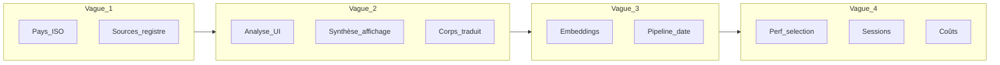

# Spec — Vue d’ensemble des vagues backend (contrat d’ordre)

**Date :** 2026-04-06  
**Statut :** adopté comme ordre de travail technique (validation PO : à confirmer en réunion si besoin ; sinon ce document fait foi pour l’implémentation).

## Objectif

Découper le périmètre « tout le backend » décrit dans [docs/plan.md](../../../plan.md) en **vagues livrables** avec dépendances explicites, sans modifier les fichiers interdits par [AGENTS.md](../../../AGENTS.md) : `generator.py`, `editorial_scope.py`, `llm_router.py`, `collector.py`.

## Ordre des vagues (contrat)

| Vague | Thèmes | Justification |
|-------|--------|---------------|
| **1** | Normalisation pays (agrégation par code ISO) ; alignement sources / registre médias revue ; cohérence chiffres Régie (santé) | Les stats et filtres « pays » alimentent le reste de l’UI ; les doublons de libellés (`MediaSource.country`) cassent la confiance. |
| **2** | Analyse d’article (visibilité skips / batch) ; unification affichage résumé / bullets (hors fichiers interdits) ; corps traduit (extraction + affichage) | Réduit la friction rédactionnelle et la qualité perçue du contenu. |
| **3** | Embeddings / clustering (périmètre opinion) ; pipeline par date (fenêtre Beyrouth, rescrape vs étapes seules) | S’appuie sur des données et affichages plus stables ; impact opérationnel fort. |
| **4** | Performance sélection d’articles ; sessions séparées par journaliste (auth + modèle) ; documentation / surface coûts LLM | Perf après stabilisation des flux ; multi-utilisateur nécessite une spec auth dédiée ; coûts en lien avec badges / Régie. |

**Transversal (plan §6 — Voix / Panorama)** : wording et éventuel ajustement de contrat API en parallèle des vagues 2 ou 3, charge permettant.

## Diagramme de dépendances

## Hors-scope global

- Aucune modification des quatre fichiers Python listés dans AGENTS.md.
- Migrations Alembic **uniquement additives** (pas de `DROP` de colonnes/tables en production sans processus explicite hors cette spec).
- La phase **uniformisation UI complète** et la **barre date type timeline** sont traitées dans [2026-04-06-phase-ux-design-system-design.md](./2026-04-06-phase-ux-design-system-design.md), après livraisons backend ciblées.

## Prochaine étape d’implémentation

Pour chaque vague : plan d’implémentation détaillé (fichiers, endpoints, tests) dérivé de la spec de vague correspondante ; revue rapide avant merge.
